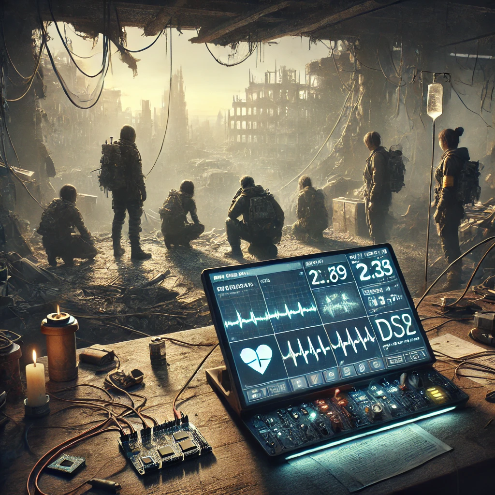

# SurvivorHealthMonitor

Cross-platform health monitoring system for embedded devices, designed to track and manage vital signs in a post-apocalyptic world using C and a TUI interface

## Chapter 1: The Pulse of Survival

### Background

In the aftermath of a catastrophic event that left the world in ruins, survival has become a day-to-day struggle. In this new world, where civilization as we knew it has crumbled, the remnants of humanity have banded together in small communities. These groups rely on each other for survival, but without proper healthcare, even minor ailments can become life-threatening.

Amidst this chaos, a group of survivors, including some of the brightest minds in electronics, bioengineering, and computer engineering, has come together with a mission: to develop a reliable health monitoring system that can help detect and prevent medical emergencies in this harsh environment. This system could be the difference between life and death for those living in the shadows of the apocalypse.

  

Early attempts to create such a system were promising but fraught with challenges. The initial team made significant strides, but as they ventured deeper into the development, they encountered obstacles that ultimately led to their downfall. Now, it is up to you and your fellow survivors to pick up where they left off and take this project to the next level.

### The Mission

You have been tasked with creating a console-based health monitoring system that interfaces with embedded hardware—either the `LPC1769` or `STM32` microcontroller. This system must be capable of reading vital signs from various sensors, processing the data, and displaying it in a clear, user-friendly manner. Additionally, the system should allow users to configure thresholds for different health metrics and trigger alerts when these thresholds are exceeded.

Looking towards the future, your system should also be designed with scalability in mind. By integrating `cJSON`, the system can format the data for easy transmission to a web server, enabling remote monitoring and data analysis. This capability will ensure that, even in the most isolated conditions, vital health information can be communicated to those who need it.

This project will not only test your technical skills but also your ability to work as a team in a world where every decision could have life-or-death consequences.

### Project Overview

#### **System Architecture:**

- **Embedded Interface:** The microcontroller board will collect data from sensors, such as heart rate, temperature, and oxygen saturation, and communicate this data to your console application.
- **Console Application:** Your primary task is to develop a console application in C that connects to the board, processes the incoming data, and provides a clear interface for monitoring and configuring the system.
- **Future Web Integration:** With cJSON, you will prepare the data for future transmission to a web server, making remote health monitoring possible.

#### **Key Learning Areas:**

- **Structs:** Use structs to model complex data types, like sensor readings and system configurations.
- **Pointers:** Efficiently manage memory and data handling using pointers, ensuring that your application can dynamically process the incoming data.
- **Good Practices:** Focus on modularity, code readability, and error handling to create a robust and maintainable system.
- **cJSON Integration:** Learn how to serialize and deserialize data into JSON format, preparing your system for future web integration.

### The Challenge

1. **Data Acquisition and Processing:**

   - Your console application will read raw data from the board, parse it into a structured format, and store it for display and further processing.
   - You'll need to use pointers effectively to manage the dynamic flow of data between your application and the hardware.

2. **Real-Time Monitoring:**

   - The application must continuously display up-to-date health metrics in the console. This requires careful handling of I/O operations and real-time data updates.

3. **Alert System:**

   - Implement a feature that allows users to set threshold values for each health metric. If any of these thresholds are crossed, the system should immediately alert the user, ensuring that any potential health risks are addressed before it's too late.

4. **Configuration Management:**

   - Provide a way for users to configure and save settings directly from the console. These configurations might include setting the thresholds, choosing which sensors to monitor, and calibrating the sensors for accurate readings.

5. **Data Serialization with cJSON:**

   - Implement cJSON to serialize the sensor data into JSON format. This will enable easy integration with a web server in the future, allowing the system to send health data remotely.

6. **Coverage and Unit Testing:**
   - Provide a close real-life example of how to write unit tests and measure code coverage using popular testing frameworks such as `unity`. Include steps to set up the testing environment, write test cases, and generate coverage reports.

### The Road Ahead

- **Phase 1:** Establish reliable communication between the console application and the microcontroller.
- **Phase 2:** Implement the data structures and functions necessary to read, store, and display sensor data.
- **Phase 3:** Develop the configuration interface and implement the alert system.
- **Phase 4:** Integrate cJSON for data serialization, preparing the system for future web connectivity.
- **Phase 5:** Implement testing to reach 90% of coverage.
- **Phase 6:** Thoroughly test the system, debug any issues, and finalize the project for presentation.

### Success Criteria

Your success in this mission will be measured not only by the functionality of your system but also by how well you apply the principles of good software development. In this world, where every line of code could save a life, the quality of your work is paramount. As you push forward, remember that the work you do today could lay the foundation for even greater achievements tomorrow.
